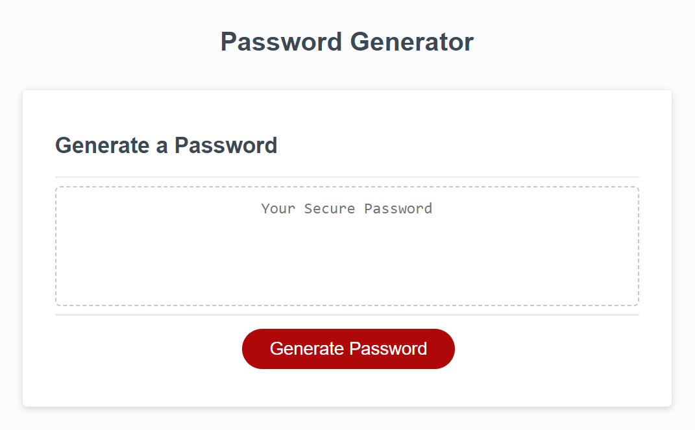

#Online Portfolio

## Description

This website was developed to help users create semi-customizeable secure passwords.

## Installation

N/A

## Usage

Click the red button to begin the password generation process.  Users will be led through in creating their password by...
* Choosing the number of characters desired (must be between 8 - and 128, inclusive)

And then choosing at least one of the following:
* Choosing whether capital letters are allowed
* Choosing whether lower case letters are allowed
* Choosing whether numbers are allowed
* Choosing whether special characters are allowed

If the user chooses no characters, they will be prompted to choose at least one, and then will start the entire process over.

## Credits

N/A

## License

N/A

## Badges

N/A

## Features

N/A

## How to Contribute

N/A

## Tests

N/A